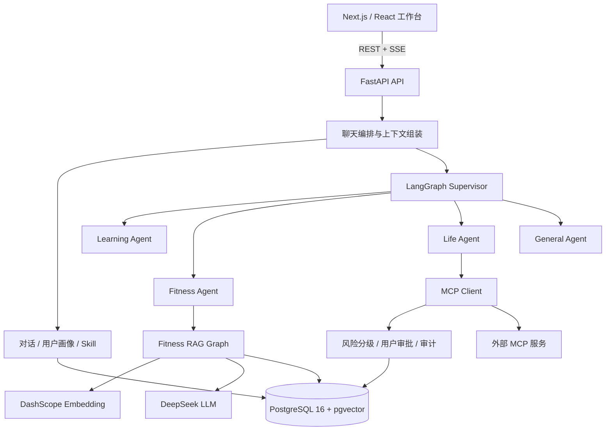
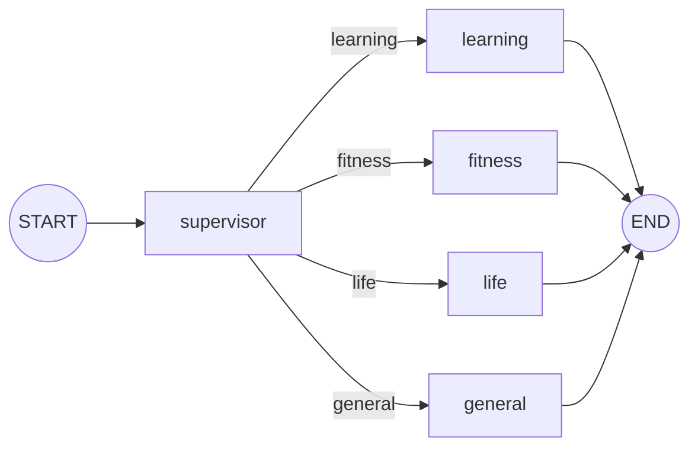
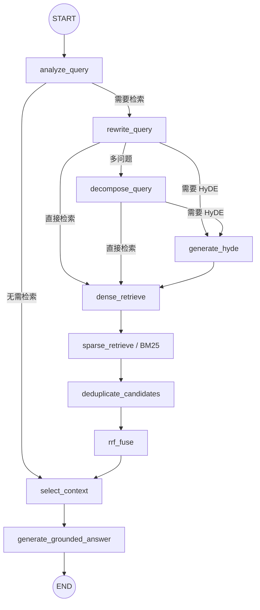

# Personal Growth Agent

一个面向个人学习、健身与日常事务的本地优先 AI 助手。项目使用 LangGraph 编排多个专业 Agent，通过 DeepSeek 生成回答、DashScope 构建 RAG 知识库，并可通过 MCP 连接外部工具。

> 当前版本为单用户 Beta：所有数据使用固定用户 `default_user`。项目尚未提供应用级登录与多用户隔离，请勿在没有额外访问控制的情况下直接暴露到公网。

## 能做什么

- **学习规划**：把学习目标整理为结构化、可调整的行动计划。
- **健身问答**：从用户导入的知识库中检索依据，生成带引用与安全提示的回答。
- **生活助手**：发现并调用 MCP 工具；高风险操作需要用户批准后才会执行。
- **长期上下文**：保存对话、用户画像候选项和可复用 Skill 候选项，由用户决定是否采纳。
- **可视化工作台**：在同一界面管理聊天、RAG 文档、MCP 服务、审批、画像和 Skill。

## 项目要解决什么问题

个人成长问题通常不是一次问答，而是一个随时间变化的过程。训练建议会受到疼痛、疲劳、睡眠、器械和既有计划影响；学习建议需要理解用户已经掌握的技术、目标和偏好；生活任务则往往需要查询实时信息或操作外部服务。普通聊天机器人容易只根据当前一句话生成通用答案，既缺少可信依据，也难以连续跟踪状态和执行任务。

本项目希望把大模型放在一个可约束、可追踪的 Agent 工作流中：由 Supervisor 识别任务领域，读取已确认的画像和 Skill，根据需要调用专业 RAG 或 MCP 工具，并将来源、执行状态和高风险审批过程返回给用户。

> 健身与健康能力只提供一般性的训练、恢复和营养信息，不进行医疗诊断，也不能替代医生、物理治疗师或其他合格专业人士。出现急性疼痛、胸闷、头晕、麻木或持续恶化等情况时，应停止相关训练并及时就医。

## 典型使用场景

下面的案例同时标注了当前实现边界。当前版本已经具备多 Agent 路由、健身 RAG、画像/Skill 候选、MCP 调用和审批等基础能力，但对动态身体状态、跨会话学习记忆和深度调研的支持仍处于早期阶段。

| 场景 | 用户需求与示例 | Agent 的作用 | 当前状态 |
| --- | --- | --- | --- |
| 1. 不适状态下调整训练 | “今天腰部酸痛，但仍想练背；健身房有高位下拉和胸托划船，哪些动作更合适？” | 组合当前不适、训练目标、器械条件和已确认画像；检索动作负荷与疼痛红旗资料；给出绕开不适区域的备选动作、停止条件与来源引用。 | 已有 Fitness Agent、画像上下文、混合检索和安全提示；身体状态仍主要依赖用户当次描述。 |
| 2. 训练后的恢复与营养 | “昨天深蹲后大腿酸痛，今晚睡眠不足，今天应该继续练腿、减量还是休息？饮食怎么安排？” | 结合近期状态和计划进行条件判断，检索 DOMS、睡眠、减量、补水和营养资料，解释建议依据并给出可调整方案。 | 已有恢复、睡眠、疼痛和营养语料；尚未接入训练日志、睡眠设备或营养记录。 |
| 3. 个性化训练计划分析 | “我每周只有三天，每次 60 分钟，目标是增肌；请检查现有计划是否覆盖推、拉、蹲、髋铰链，并安排恢复。” | 将目标、经验、时间、偏好和限制转化为约束，分析计划覆盖度、负荷与恢复安排，并根据后续反馈持续修订。 | 可利用画像和健身知识回答；周期化计划、训练负荷追踪和自动调节仍是目标能力。 |
| 4. 连续学习规划与深度调研 | “我学过 Python 和 FastAPI，现在想学习 LangGraph；请利用我的学习偏好制定计划，并把 Agent 记忆拆成若干主题分别调研。” | 读取既有技能和偏好，识别新旧知识的连接；生成阶段计划；需要外部资料时拆分子问题、分别调研并汇总。 | 已有 Learning Agent、画像/Skill 上下文和结构化计划；尚无完整的多步骤深度调研图。 |
| 5. 生活事务与外部工具 | “查询周五去上海的航班和天气，比较方案后生成行程；涉及预订前先让我确认。” | 判断需要哪些实时工具，调用航班、天气、地图或日历 MCP；聚合结果；对产生费用、写入或发送等高风险操作发起审批。 | 已有 MCP 客户端边界、参数校验、风险分级、审批和审计；具体能力取决于接入的 MCP 服务。 |

### 为什么需要 Agent，而不是普通聊天机器人

- **需要状态**：同一个问题会因用户画像、历史计划、疼痛和恢复状态不同而产生不同答案。
- **需要可靠依据**：健身健康建议应从经过筛选的知识库检索并展示引用，而不是仅依赖模型记忆。
- **需要分工与路由**：学习规划、健身检索和生活工具调用需要不同的上下文、安全策略和输出结构。
- **需要多步骤执行**：调研、检索、工具调用、结果汇总和计划修订不是一次文本补全可以稳定完成的流程。
- **需要安全控制**：外部工具可能产生费用或修改数据，必须经过参数校验、风险分级、用户审批和审计。
- **需要可观察和可评估**：LangGraph 节点、RAG trace、来源和状态事件让系统行为更容易调试与回归。

## 技术架构



主要技术栈：Python 3.12、FastAPI、LangGraph、Next.js 16、React 19、PostgreSQL、pgvector、Docker Compose。

## Agent 与 RAG 工作流

### 顶层 Supervisor Graph



当前 Supervisor 使用确定性关键词路由。四个业务节点分别负责学习计划、健身 RAG、MCP 生活工具和通用回答。这种受限图结构较容易测试和控制，但对复合意图和隐含意图的识别能力有限。

`GraphState` 的主要状态如下：

| 状态组 | 字段 | 作用 |
| --- | --- | --- |
| 请求与会话 | `message`、`history`、`thread_id`、`user_id`、`run_id` | 保存本轮输入、短期历史和运行标识 |
| 路由与输出 | `route`、`response`、`status_records` | 保存 Supervisor 选择、最终回答和节点状态事件 |
| 学习 | `learning_plan` | 保存结构化学习计划 |
| 健身 RAG | `rag_collection_ids`、`rag_sources`、`rag_no_match_reason`、`rag_service` | 约束知识库范围并返回来源或无匹配原因 |
| MCP | `enabled_mcp_server_ids`、`mcp_service`、`mcp_tool_calls`、`approval_requests` | 保存允许使用的服务、工具调用和审批请求 |
| 长期上下文 | `profile_context`、`skill_context` | 向 Agent 提供用户已确认的画像和可复用策略 |

### Fitness RAG Graph



RAG 状态记录独立查询、子查询、HyDE 文本、Dense/BM25 排名、候选块、RRF 融合结果、最终来源、无匹配原因和逐阶段 trace。最终回答只能依据选中的证据生成，并要求关键建议携带引用和安全边界。

## 健身 RAG 数据与质量评估

### 当前实验数据

当前仓库包含 12 份用于实验的中文 Markdown 语料，覆盖身体活动指南、力量进阶、初学者计划、深蹲/髋铰链/上肢动作、跑步、恢复睡眠、营养补水、疼痛红旗、老年平衡和热身活动。这些语料适合验证检索链路，但不能替代系统化的专业知识库。正式资料来源与授权信息将在后续完成资料筛选后补充。

动作和器械数据后续应使用结构化记录，而不只是长文本，例如动作模式、主要/辅助肌群、器械要求、稳定性要求、身体负荷区域、替代动作和安全提示。这能支持“想练某部位，同时绕开不适区域”一类包含多重约束的检索。

### 如何评估回答质量

- **检索质量**：Recall@K、MRR、来源命中率，以及 Context Precision/Recall。
- **生成质量**：忠实度、问题相关性、引用是否真正支持对应结论。
- **个性化质量**：是否正确使用用户目标、状态、器械和偏好，是否遗漏关键限制。
- **安全质量**：红旗症状召回率、危险建议率、是否恰当拒绝诊断并建议就医。
- **可用性**：建议是否具体、可执行，是否提供替代方案和停止条件。
- **工程指标**：P50/P95 延迟、无结果率、外部服务失败率、Token 与单次回答成本。

仓库内置 30 条评估用例，覆盖事实、改写、计划、排错、误区、实体数字和安全警示问题。完整评估使用真实 PostgreSQL/pgvector、DashScope `text-embedding-v3`、Dense + BM25 + RRF 和 DeepSeek 回答，再由 RAGAS 六项指标评分。

### RAGAS 六项指标

| 指标 | 含义 | 方向 | 当前公开结果 |
| --- | --- | --- | --- |
| Faithfulness | 回答中的陈述能否由检索上下文支持，反映幻觉程度 | 越高越好 | 待补充 |
| Answer Relevancy | 回答是否直接回应用户问题，是否存在跑题或冗余 | 越高越好 | 待补充 |
| Context Precision | 排在前面的检索上下文中，真正相关内容所占程度 | 越高越好 | 待补充 |
| Context Entity Recall | 参考答案中的关键实体有多少出现在检索上下文中 | 越高越好 | 待补充 |
| Noise Sensitivity (`irrelevant`) | 回答受到无关上下文误导的程度 | 越低越好 | 待补充 |
| Context Recall | 参考答案所需的信息有多少被检索上下文覆盖 | 越高越好 | 待补充 |

具体运行方法见 [`backend/evaluation/README.md`](backend/evaluation/README.md)。结果会受到语料、模型版本、参数和裁判模型波动影响；公开分数时应同时提供样本数、运行时间、失败指标调用数和复现配置。

### 已知缺陷

- 身体状态主要来自当前消息和已确认画像，没有结构化的每日疲劳、疼痛、睡眠和训练负荷时间序列。
- 现有实验语料规模较小，正式知识库的数据治理尚未完成。
- Dense + BM25 + RRF 已实现，但没有 Cross-Encoder/LLM reranker，也没有按伤病、动作、器械等元数据进行系统化过滤。
- Supervisor 依赖关键词，复合问题、隐含意图和学习/健身交叉问题可能被错误路由。
- RAGAS 依赖 LLM 裁判，存在随机性和供应商偏差；当前缺少专业教练或运动医学人员的盲评。
- 当前是固定 `default_user` 的单用户 Beta，不能直接用于多用户生产环境。
- 系统无法确认用户描述是否医学准确，也不能凭文本排除伤病；安全策略必须保持保守。

## 项目演示建议

推荐采用 **3 分钟主视频 + README 短动图**。视频负责讲清完整故事，动图让访问仓库的人无需点开视频就能快速看到核心交互。演示素材和链接将在后续补充。

| 时间 | 内容 | 需要展示的价值 |
| --- | --- | --- |
| 0:00–0:20 | 说明通用聊天无法持续理解身体状态、学习背景，也缺少可信知识和安全工具边界 | 项目动机 |
| 0:20–1:15 | 演示腰部不适但想练背：展示画像、Fitness 路由、RAG 来源、替代动作和停止条件 | 个性化、可引用、安全 |
| 1:15–1:50 | 导入知识文档并再次提问，展示混合检索来源和 RAG 评估方法 | RAG 可追踪、可评估 |
| 1:50–2:25 | 演示学习偏好如何影响结构化学习计划 | 长期上下文与领域分工 |
| 2:25–2:50 | 调用 Time MCP，再展示高风险工具进入审批而不是直接执行 | 工具能力与安全控制 |
| 2:50–3:00 | 展示架构图和当前限制：单用户 Beta、非医疗诊断 | 工程完整性与诚实边界 |

## 快速开始（推荐）

### 前置条件

- Docker Engine 或 Docker Desktop，并支持 Compose v2
- DeepSeek API Key
- DashScope API Key（用于知识库向量化与检索）

### 1. 克隆并配置

```bash
git clone https://github.com/YiCon4213/personal_growth_agent.git
cd personal_growth_agent
cp backend/.env.example backend/.env
```

Windows PowerShell 可将最后一行替换为：

```powershell
Copy-Item backend/.env.example backend/.env
```

编辑 `backend/.env`，至少填写：

```env
DEEPSEEK_API_KEY=your_deepseek_api_key
DASHSCOPE_API_KEY=your_dashscope_api_key
```

不要提交包含真实密钥的 `.env` 文件。

### 2. 启动完整服务

```bash
docker compose -f infra/docker-compose.yml up --build -d --wait
```

启动完成后访问：

- Web 界面：<http://127.0.0.1:3000>
- 后端健康检查：<http://127.0.0.1:8000/api/v1/health>
- PostgreSQL：`127.0.0.1:5433`

查看状态或停止服务：

```bash
docker compose -f infra/docker-compose.yml ps
docker compose -f infra/docker-compose.yml down
```

`down` 默认保留 PostgreSQL 命名卷中的数据。除非确定要永久删除数据，否则不要使用 `--volumes`。

## 首次使用

1. 打开 Web 界面并发送学习、健身或生活类问题。
2. 健身 RAG 问答前，在知识库面板导入 Markdown、TXT 或文本型 PDF。
3. 如需工具调用，在 MCP 面板添加服务并刷新工具列表。
4. 在审批、画像和 Skill 面板中检查待确认项目。

应用默认不自动配置 MCP 服务。若要使用 Time MCP，需要主机已安装 `uvx`，然后在 MCP 面板/API 中创建 stdio 服务：命令为 `uvx`，参数为 `mcp-server-time --local-timezone=Asia/Shanghai`。

## 本地开发

### 后端

后端使用 [uv](https://docs.astral.sh/uv/) 管理依赖：

```bash
cd backend
uv sync --group dev
uv run uvicorn app.main:app --reload
```

仅启动开发数据库：

```bash
docker compose -f infra/docker-compose.yml up -d postgres --wait
```

### 前端

```bash
cd frontend
npm ci
npm run dev
```

前端默认将 `/api/v1/*` 转发到 `http://127.0.0.1:8000`。

## 测试与质量检查

```bash
cd backend
uv run pytest -q
```

```bash
cd frontend
npm run lint
npm run typecheck
npm run build
```

自动化测试使用 fake LLM、embedding 和 MCP 客户端，不会消耗真实服务额度。真实 RAG 评估方法见 [`backend/evaluation/README.md`](backend/evaluation/README.md)。

## 配置说明

完整配置及默认值见 [`backend/.env.example`](backend/.env.example)。常用配置包括：

| 配置 | 用途 |
| --- | --- |
| `DEEPSEEK_API_KEY` | DeepSeek/OpenAI-compatible 聊天模型凭据 |
| `DASHSCOPE_API_KEY` | DashScope `text-embedding-v3` 凭据 |
| `DATABASE_URL` | 后端数据库连接；Compose 会自动覆盖为容器地址 |
| `ALLOWED_HOSTS` | 后端允许的 Host 列表 |
| `MCP_STDIO_ALLOWED_COMMANDS` | 允许启动的 stdio MCP 命令 |
| `MCP_STDIO_ALLOWED_TARGETS` | 允许的 stdio MCP 包/目标 |
| `MCP_REMOTE_ALLOWED_HOSTS` | 生产环境允许连接的远程 HTTPS MCP 主机 |

## 项目结构

```text
backend/                 FastAPI、LangGraph、数据模型、服务与测试
backend/evaluation/      真实模型 RAG 评估脚本与语料
frontend/                Next.js 用户界面
infra/                   Compose、Caddy、迁移和备份脚本
docs/ROADMAP.md          当前能力、已知限制与公开路线图
```

## 公网部署

[`infra/docker-compose.public.yml`](infra/docker-compose.public.yml) 提供 Caddy HTTPS 和强制 Basic Auth 的部署模板。完整的 DNS、证书、防火墙、备份与恢复步骤见 [`infra/README.md`](infra/README.md)。

公网部署前请特别注意：

- 当前没有应用级身份认证或多用户数据隔离；
- Basic Auth 只是临时外围保护，不能替代正式账号系统；
- PostgreSQL、后端和前端诊断端口应保持仅绑定 `127.0.0.1`；
- 当前限流器为单进程内存实现，横向扩容前需要共享限流层；
- 请先完成离机备份和隔离恢复演练。

## 当前限制与路线图

项目的实现状态、已知限制和下一步计划见 [`docs/ROADMAP.md`](docs/ROADMAP.md)。主要限制包括固定单用户、关键词式 Supervisor 路由、远程 Streamable HTTP MCP 尚未完成真实环境验证，以及应用级认证尚未实现。

## 许可证

仓库目前尚未添加开源许可证。在许可证明确之前，源代码仅可按 GitHub 服务条款查看和分叉，不代表已授予复制、修改或分发权利。
